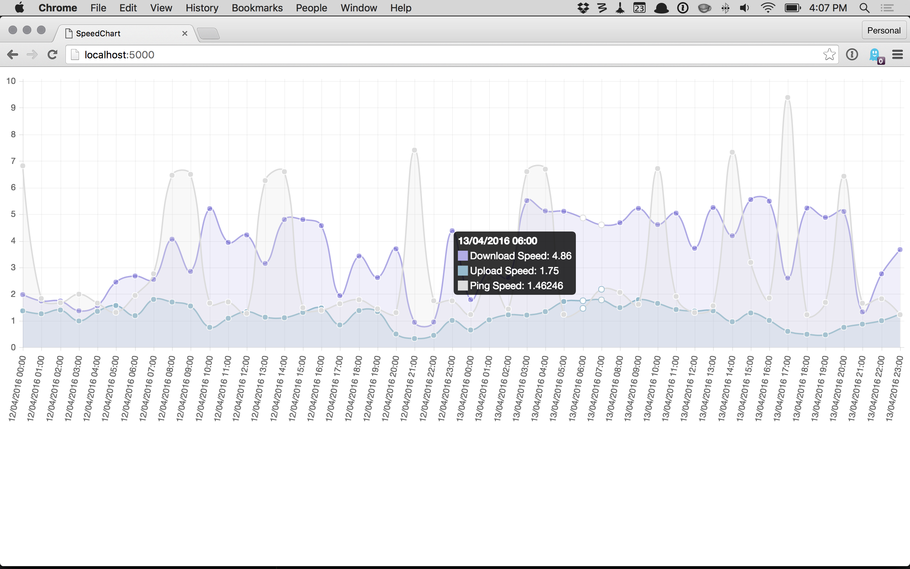

# SpeedChart

Chart your network speed, as reported by speedtest-cli.

Inspired by [speedtest-cron](https://github.com/vwillcox/speedtest-cron). Written in Python to play as nicely as possible with Raspberry Pi, and also for me to get more practice with the language and its ecosystem (I normally write Ruby).

## Usage

This will be cleaned up as I understand the Python ecosystem and Flask deployments better. For now, you can run it on your favorite localhost like so:

- Gather some network speed data using speedtest-cron.
- Copy or move your `*.speedtest.txt` files from speedtest-cron into the `data` directory.
- `pip install flask`
- `python run.py`

Visit <http://localhost:5000> in your favorite browser to see a chart of your network speeds.

## TODO

Probably more than this, but to start:

- ~~Wrap in a simple (Flask?) web app to display the results in a chart, probably using Chart.js (hence the creative name, SpeedChart)~~
- Finish Flask setup so the app can run outside of a development environment
- Add test coverage
- Refactor the parser (this is a hack so far)
- Replace the dependency on speedtest-cron, so this can run standalone
- Add filtering for starting/ending timestamps
- Compute averages over displayed results
- Visualize speeds the ISP advertises
- Figure out best way to overlay ping speeds with download/upload speeds (my connection is slow, so dividing the ping speed by 100 works well in my case, but perhaps not so much on better connections)
